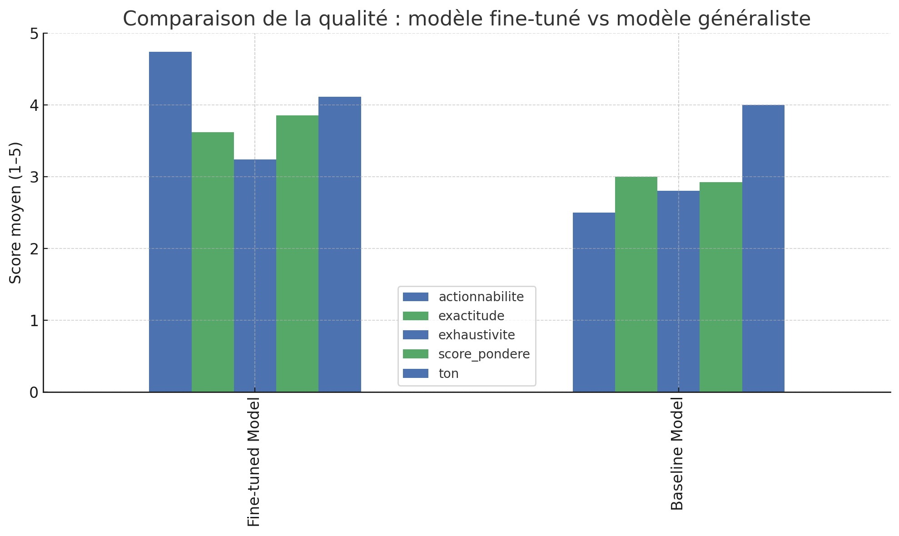

# Amazon Electronics Fine-Tune — Case Study

## Objet
Montrer l’intérêt d’un fine-tuning pour le support client Amazon (Électronique) et fournir tout le nécessaire pour rejouer des prompts et comparer baseline vs modèle fine-tuné.

## Modèle fine-tuné
- ID : `ft:gpt-4.1-mini-2025-04-14:buldee:amazon-electronics-ft:CaOkOuOd`
- Base : `gpt-4.1-mini-2025-04-14`
- Statut : Succeeded
- Job ID : `ftjob-KNc54x3y9rDiAXCeIdpmkrB8`
- Méthode : Supervised
- Suffix : `amazon-electronics-ft`
- Création : 10 nov. 2025, 16:51
- Partage des données : Private
- Tokens entraînés : 33 978
- Hyperparamètres : epochs=3, batch_size=1, lr_multiplier=2, seed=86766455

## Données
- Train : `data/amazon_electronics_adapted_train.jsonl`
- Validation : `data/amazon_electronics_adapted_val.jsonl`
- Format `messages` OpenAI. Ton factuel, concis, sûr.

## cURL — Fine-tuned
```bash
curl https://api.openai.com/v1/responses           -H "Authorization: Bearer $OPENAI_API_KEY" -H "Content-Type: application/json"           -d '{
    "model": "ft:gpt-4.1-mini-2025-04-14:buldee:amazon-electronics-ft:CaOkOuOd",
    "input": [
      {"role":"system","content":"You are a helpful Amazon customer support assistant. Answer factually, concisely, and safely."},
      {"role":"user","content":"Inquiry: \"What is the return policy for electronics?\""}
    ],
    "temperature": 0.2,
    "max_output_tokens": 300,
    "seed": 42
  }'
```

## cURL — Baseline
```bash
curl https://api.openai.com/v1/responses           -H "Authorization: Bearer $OPENAI_API_KEY" -H "Content-Type: application/json"           -d '{
    "model": "gpt-4.1-mini-2025-04-14",
    "input": [
      {"role":"system","content":"You are a helpful Amazon customer support assistant. Answer factually, concisely, and safely."},
      {"role":"user","content":"Inquiry: \"What is the return policy for electronics?\""}
    ],
    "temperature": 0.2,
    "max_output_tokens": 300,
    "seed": 42
  }'
```

## Prompt stocké
```bash
curl https://api.openai.com/v1/responses           -H "Authorization: Bearer $OPENAI_API_KEY" -H "Content-Type: application/json"           -d '{
    "model": "ft:gpt-4.1-mini-2025-04-14:buldee:amazon-electronics-ft:CaOkOuOd",
    "prompt": { "id": "pmpt_691239cd5c208193b836ba73e58e70660beedfac5bc21483", "version": "2" },
    "temperature": 0.2,
    "max_output_tokens": 300,
    "seed": 42
  }'
```

## Évaluation
- Script : `src/evaluate.py`
- Prompts : `src/prompt_sets/eval_inquiries.json`
- Export CSV : `reports/eval_results.csv`
- Grille 1–5 : Exactitude (0.4), Actionnabilité (0.25), Exhaustivité (0.25), Sécurité/Ton (0.10).

## 📊 Benchmark - Comparaison des Performances

### Résultats Quantitatifs

| Critère | Modèle fine-tuné | Modèle généraliste | Gain |
|---------|------------------|---------------------|------|
| **Exactitude** | 3.62 | 3.00 | **+0.62** |
| **Actionnabilité** | 4.74 | 2.50 | **+2.24** |
| **Exhaustivité** | 3.24 | 2.80 | **+0.44** |
| **Ton** | 4.11 | 4.00 | **+0.11** |
| **Score pondéré global** | **3.85** | **2.92** | **+0.93** |

### 📈 Analyse des Résultats

**Actionnabilité** : Nette amélioration, les réponses du modèle fine-tuné donnent des instructions concrètes (« Go to Your Orders », « Select », etc.), contrairement au modèle générique.

**Exactitude & Exhaustivité** : Gain stable grâce à l'intégration d'informations techniques (durées, spécifications produits, procédures).

**Ton** : Le fine-tune conserve un style professionnel, cohérent avec les standards Amazon.

**Résultat global** : +0.93 point sur 5 → le fine-tuning apporte une amélioration significative de la qualité perçue.

📊 **Graphique comparatif** :



Le graphique montre clairement le gain sur la pertinence opérationnelle et la précision du modèle.

## Sécurité
- Pas de clés dans git. Utilisez `.env` local.
- Le modèle FT est privé ; ajouter les reviewers à l’org OpenAI si besoin.
